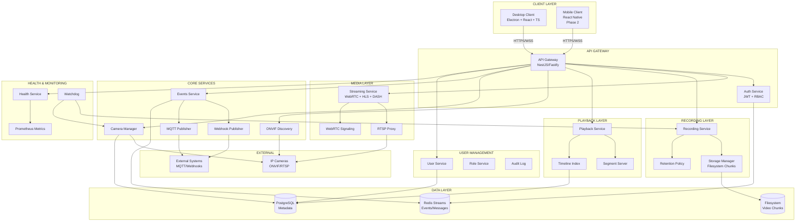

# VMS Architecture Overview

## Project Name: NXvms (Open Video Management System)

## Module Map

### CLIENT MODULES (Desktop)
```
client/
├── core/                          # Core application framework
│   ├── app.ts                     # Electron main process entry
│   ├── window-manager.ts         # Multi-window management
│   ├── ipc-bridge.ts              # IPC communication bridge
│   └── store/                     # State management (Redux/Zustand)
│
├── auth/                          # Authentication module
│   ├── login-screen.tsx           # Login UI
│   ├── server-selector.tsx        # Multi-server directory
│   ├── token-manager.ts           # JWT + refresh token handling
│   └── auth-api.ts                # Auth API client
│
├── resources/                     # Resource tree module
│   ├── resource-tree.tsx          # Tree component (sites→servers→cameras)
│   ├── resource-service.ts        # Resource API client
│   └── resource-types.ts          # Type definitions
│
├── layout/                        # Layout management
│   ├── layout-manager.tsx         # Layout selector/manager
│   ├── grid-layout.tsx            # 1,4,9,16, custom grid
│   ├── fullscreen-manager.ts      # Fullscreen handling
│   └── multi-monitor.ts          # Multi-monitor support
│
├── live-view/                     # Live viewing module
│   ├── video-player.tsx           # Video player component
│   ├── stream-client.ts           # WebRTC/HLS stream client
│   ├── ptz-controls.tsx           # PTZ control panel
│   ├── digital-zoom.tsx           # Digital zoom overlay
│   └── snapshot.ts                # Snapshot capture
│
├── playback/                      # Playback module
│   ├── playback-view.tsx          # Playback UI
│   ├── timeline.tsx               # Timeline component
│   ├── scrubber.tsx               # Scrubbing control
│   ├── speed-control.tsx          # Playback speed (0.25x-16x)
│   └── frame-step.ts              # Frame-by-frame navigation
│
├── events/                        # Events module
│   ├── events-panel.tsx           # Events list view
│   ├── event-filter.tsx           # Event filtering
│   └── smart-search.tsx           # Smart search placeholder
│
├── bookmarks/                     # Bookmarks module
│   ├── bookmarks-manager.tsx      # Bookmarks UI
│   ├── tags-manager.tsx           # Tags/notes UI
│   └── bookmarks-api.ts           # Bookmarks API client
│
├── export/                        # Export module
│   ├── export-dialog.tsx          # Export configuration
│   ├── export-progress.tsx        # Export progress
│   ├── watermark.ts                # Watermark application
│   └── hash-generator.ts          # Clip hash generation
│
├── health/                        # Health monitoring UI
│   ├── health-dashboard.tsx       # Health overview
│   ├── camera-status.tsx          # Per-camera status
│   ├── storage-status.tsx         # Storage information
│   └── alerts-panel.tsx           # Alerts/warnings
│
├── notifications/                 # Notifications module
│   ├── in-app-notifications.tsx   # In-app notifications
│   ├── desktop-notifications.ts   # Desktop notifications
│   └── notification-service.ts    # Notification handling
│
├── permissions/                   # Permissions UI
│   ├── user-management.tsx        # User management
│   ├── role-management.tsx        # Role management
│   └── acl-editor.tsx             # ACL editor
│
├── shared/                        # Shared utilities
│   ├── api-client.ts              # Base API client
│   ├── types.ts                   # Shared type definitions
│   ├── constants.ts               # Application constants
│   ├── utils.ts                   # Utility functions
│   └── theme/                     # UI theme
│
└── mock-server/                   # Mock server for development
    ├── mock-api.ts                # Mock API endpoints
    └── mock-data.ts               # Mock data generators
```

### SERVER MODULES
```
server/
├── core/                          # Core application framework
│   ├── main.ts                    # Application entry
│   ├── app.module.ts              # NestJS root module
│   ├── config/                    # Configuration management
│   └── middleware/                # Custom middleware
│
├── auth/                          # Authentication module
│   ├── auth.controller.ts         # Auth endpoints
│   ├── auth.service.ts            # Auth logic
│   ├── jwt.strategy.ts            # JWT strategy
│   ├── rbac.guard.ts              # RBAC guard
│   └── oidc/                      # OIDC/SSO (optional)
│
├── resources/                     # Resource management
│   ├── resources.controller.ts    # Resource endpoints
│   ├── resources.service.ts       # Resource logic
│   ├── onvif-discovery.ts         # ONVIF WS-Discovery
│   ├── camera-manager.ts          # Camera lifecycle
│   └── group-manager.ts           # Group management
│
├── streaming/                     # Media streaming
│   ├── streaming.controller.ts    # Streaming endpoints
│   ├── rtsp-proxy.ts              # RTSP proxy
│   ├── webrtc-signaling.ts        # WebRTC signaling
│   ├── hls-generator.ts           # HLS segmenter
│   └── dash-generator.ts          # DASH segmenter
│
├── recording/                     # Recording pipeline
│   ├── recording.service.ts       # Recording orchestration
│   ├── stream-recorder.ts         # Per-stream recorder
│   ├── storage-manager.ts         # Storage management
│   ├── retention-policy.ts        # Retention enforcement
│   └── chunk-manager.ts           # Video chunk management
│
├── playback/                      # Playback service
│   ├── playback.controller.ts     # Playback endpoints
│   ├── playback.service.ts        # Playback logic
│   ├── segment-server.ts          # Segment serving
│   └── timeline-index.ts          # Timeline indexing
│
├── events/                        # Events system
│   ├── events.controller.ts       # Events endpoints
│   ├── events.service.ts          # Events logic
│   ├── motion-detector.ts         # Motion detection (optional)
│   ├── webhook-publisher.ts       # Webhook publishing
│   └── mqtt-publisher.ts          # MQTT publishing
│
├── users/                         # User management
│   ├── users.controller.ts        # User endpoints
│   ├── users.service.ts           # User logic
│   ├── roles.service.ts           # Role management
│   └── audit-log.service.ts       # Audit logging
│
├── health/                        # Health monitoring
│   ├── health.controller.ts       # Health endpoints
│   ├── health.service.ts          # Health checks
│   ├── metrics.service.ts         # Prometheus metrics
│   ├── watchdog.ts                # Watchdog service
│   └── alert-rules.ts             # Alert rule engine
│
├── api/                           # Public API
│   ├── api.controller.ts          # API endpoints
│   ├── api-key.service.ts         # API key management
│   └── openapi/                   # OpenAPI spec
│
├── database/                      # Database layer
│   ├── migrations/                # DB migrations
│   ├── entities/                  # TypeORM entities
│   └── repositories/              # Custom repositories
│
└── shared/                        # Shared utilities
    ├── types.ts                   # Shared types
    ├── constants.ts               # Constants
    ├── utils.ts                   # Utilities
    └── logger.ts                  # Logging wrapper
```

## System Architecture Diagram



## Technology Stack Decisions

### Client Stack: Electron + React + TypeScript
**Rationale:**
- **Electron**: Cross-platform desktop support (Windows, macOS, Linux), native integration for notifications, multi-monitor support
- **React**: Component-based architecture, excellent ecosystem, easy state management
- **TypeScript**: Type safety, better IDE support, catches errors early

**Alternative Considered (Qt):** Qt would provide better native performance but has steeper learning curve and less modern web development ecosystem. Electron is sufficient for VMS requirements.

### Server Stack: NestJS + TypeScript
**Rationale:**
- **NestJS**: Built-in dependency injection, modular architecture, excellent TypeScript support, easy testing
- **TypeScript**: Consistency with client, shared type definitions
- **Fastify option**: Could be used for better performance, but NestJS provides better structure

**Alternative Considered (Go):** Go would provide better performance and lower resource usage, but TypeScript offers faster development, better ecosystem for media handling, and code sharing with client.

### Media Pipeline: FFmpeg
**Rationale:**
- **FFmpeg**: Industry standard, supports virtually all codecs/containers, excellent RTSP handling
- **Copy mode**: Can record without transcoding (remux) for minimal CPU usage
- **Transcoding**: Available when needed for compatibility or bandwidth optimization

**Alternative Considered (GStreamer):** GStreamer is more flexible but has steeper learning curve and more complex deployment. FFmpeg is sufficient and more widely adopted.

### Database: PostgreSQL
**Rationale:**
- **PostgreSQL**: ACID compliance, excellent for relational data, JSON support for flexible metadata, proven scalability

### Messaging: Redis Streams
**Rationale:**
- **Redis Streams**: Lightweight, fast, built-in consumer groups, perfect for event streaming
- **Alternative (NATS)**: NATS JetStream is also excellent, but Redis is often already present in infrastructure

### Media Transport to Client: WebRTC + HLS/DASH
**Rationale:**
- **WebRTC**: Ultra-low latency (<100ms), ideal for live PTZ operations
- **HLS/DASH**: Better compatibility, works through firewalls/NAT, good for playback
- **RTSP Proxy**: For legacy clients or specific use cases

## Performance & Scale Targets

### Server Capacity
- **Target**: 50-200 cameras per server
- **Factors limiting scale**:
  - Network bandwidth (1 camera @ 4Mbps = 200 cameras @ 800Mbps)
  - Storage I/O (recording many streams simultaneously)
  - CPU (if transcoding is required)
  - RAM (buffering, indexing)

### Optimization Strategies
1. **Copy mode recording**: No transcoding during recording (remux only)
2. **Substream support**: Use low-res substream for preview, high-res for recording
3. **Lazy transcoding**: Transcode only on-demand for playback
4. **Distributed storage**: Multiple storage pools for scalability
5. **Load balancing**: Multiple servers for multi-site deployments

## Security Architecture

### Authentication & Authorization
- **JWT access tokens**: Short-lived (15-30 minutes)
- **Refresh tokens**: Long-lived, stored securely, rotation on refresh
- **RBAC**: Role-based access control with granular permissions
- **OIDC/SSO**: Optional integration with identity providers

### Transport Security
- **TLS 1.3**: All API communication over HTTPS
- **WSS**: Secure WebSockets for real-time communication
- **Certificate pinning**: Optional for enhanced security

### Data Security
- **Secrets management**: Environment variables or secret manager
- **Rate limiting**: Per-user and per-IP limits
- **Audit logging**: All sensitive actions logged
- **Data redaction**: Sensitive data redacted from logs

## Multi-Site Architecture

### Design Principles
1. **Server directory**: Central directory of all servers
2. **Per-server auth**: Each server maintains its own user database
3. **Cross-server search**: Optional federated search capability
4. **Unified client**: Single client can connect to multiple servers

### Implementation
- Client maintains server directory (stored locally or in cloud)
- Each server is independently deployable
- Optional "management server" for centralized user management (Phase 2)

## Integration Points

### MQTT Module
- Publish events to MQTT topics
- Subscribe to commands from external systems
- Topic structure: `vms/{site}/{server}/{camera}/{event_type}`

### Webhook Module
- HTTP POST notifications to configured endpoints
- Retry logic with exponential backoff
- Signature verification for security

### Public API/SDK
- RESTful API with OpenAPI documentation
- SDK libraries for popular languages (JavaScript, Python)
- API key authentication for external integrations

## Development Phases

### Phase 1: MVP (Current Focus)
- Basic camera discovery and connection
- Live viewing
- Recording and playback
- User authentication
- Basic events

### Phase 2: Enhanced Features
- Advanced analytics
- Multi-site management
- Mobile client
- SSO integration
- Advanced search

### Phase 3: Enterprise
- High availability
- Disaster recovery
- Advanced analytics
- Cloud storage integration
